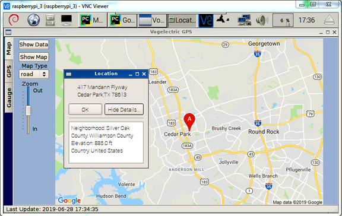
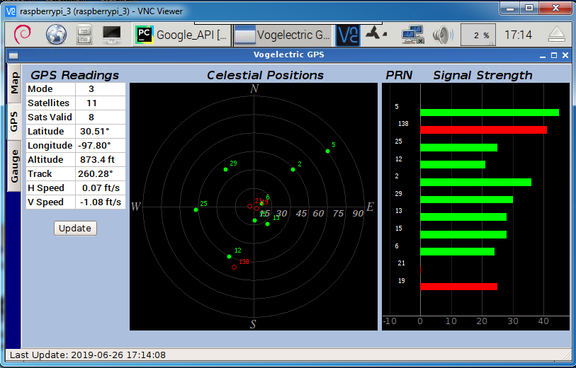
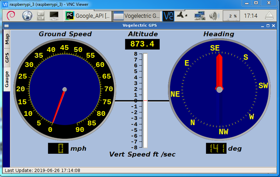

# Pi-GPS-GUI
## Overview -Interfacing a GPS board with a Raspberry Pi
The purpose of this project was to explores the use of a GPS receiver integrated with a Raspberry Pi. Development started with getting basic communication established with the device and ending with several applications collected in a GUI. The GPS used was an <a href="https://learn.adafruit.com/adafruit-ultimate-gps-hat-for-raspberry-pi/overview">Adafruit Ultimate GPS hat</a>. After the initial setup following the Adafruit [instructions](DOC/adafruit-ultimate-gps-hat-for-raspberry-pi.pdf), a GUI was developed in QT5 designer and Python3 code written to support the concept test applications. The concept applications were distributed on tabs in the GUI since each concept was of a different nature.
## Concept Applications Descriptions

### Google Maps Location Finder
*Google Maps API*

### GPS Position Readout and Satalite Location Chart
*GPS Satalite Location and Signal Strength*

### Spedometer, Compass and Vertical Speed Dashboard
*Dashboard Gagues*

